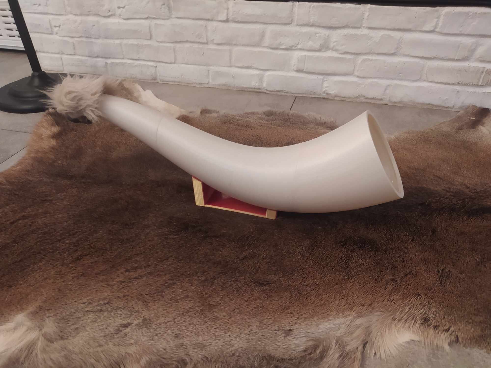
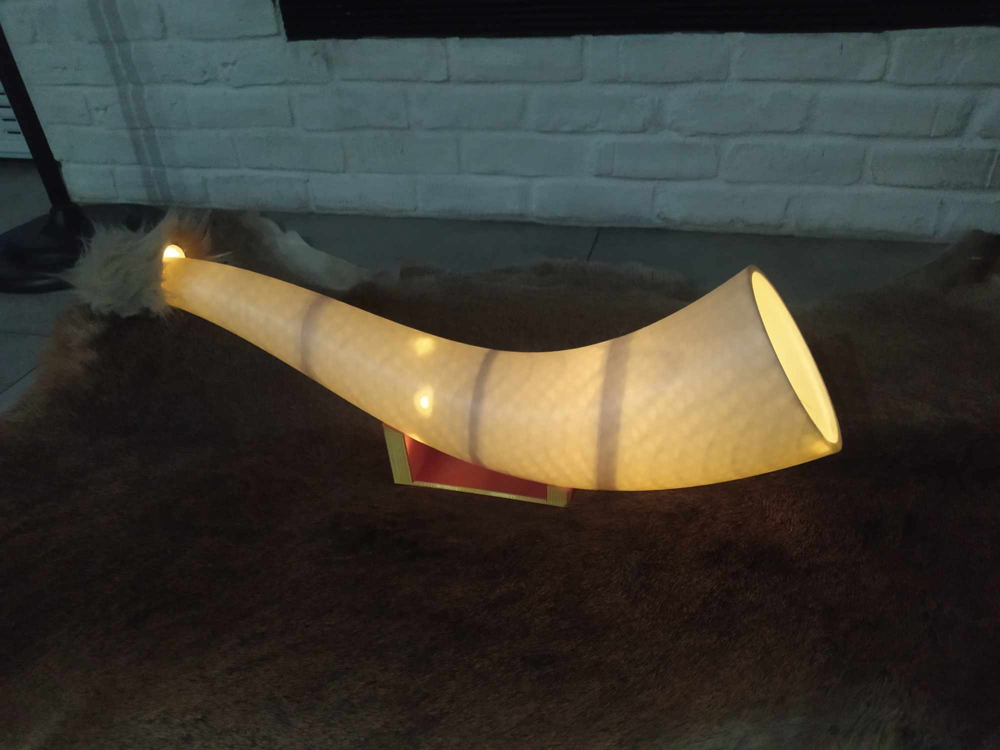

# horn_of_plenty
The motivation: 
https://wiki.dfrobot.com/Fermion_MEMS_Microphone_Sensor_SKU_SEN0487
https://www.waveshare.com/wiki/Li-polymer_Battery_HAT

The 3d model of horn:





[Fusion 360 model link](https://a360.co/46Jb5fT)

[twilio console with billing info](https://console.twilio.com/us1/billing/manage-billing/billing-overview)


## Docker 

1. Build
```
docker build . -t horn_backend:v0.1.0 
```

2. run locally
```
docker run -p 8080:8080 horn_backend:v0.1.0

```
